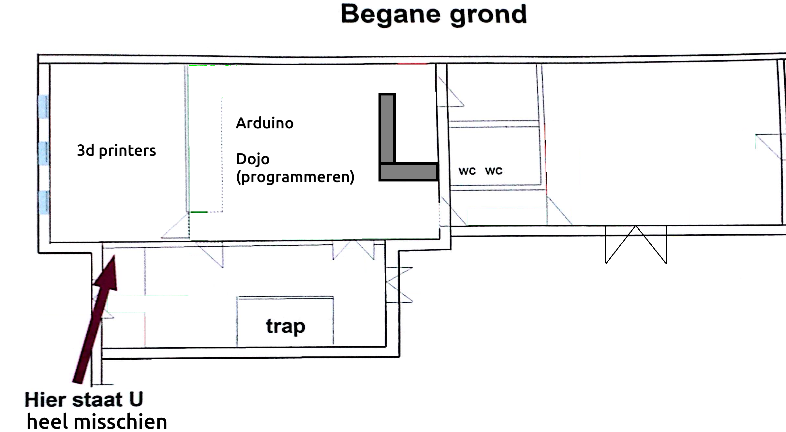
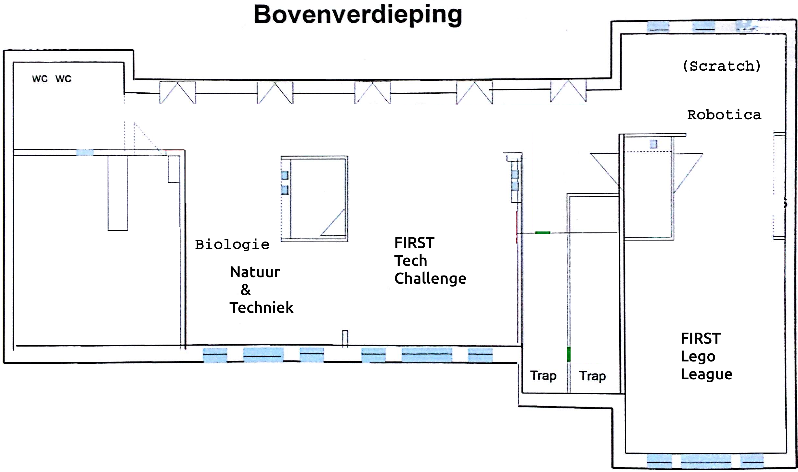
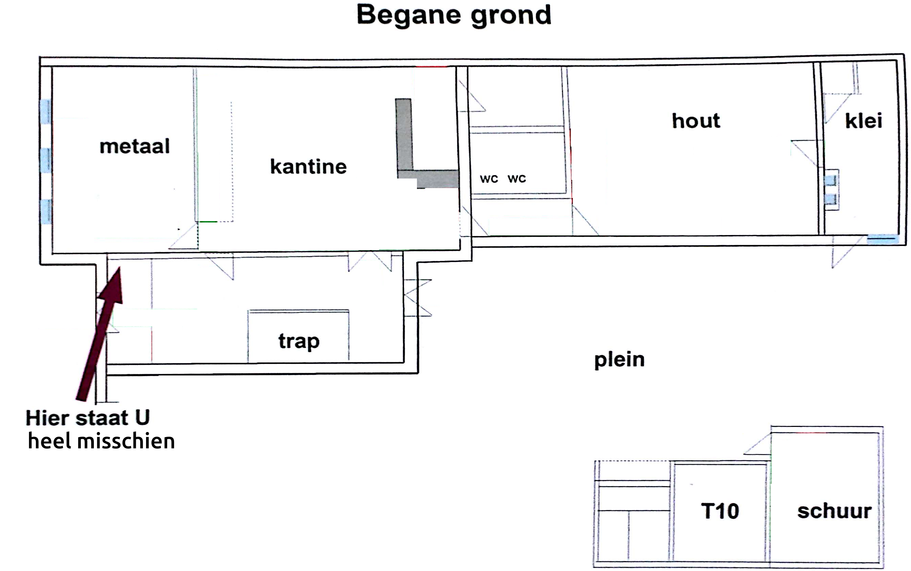
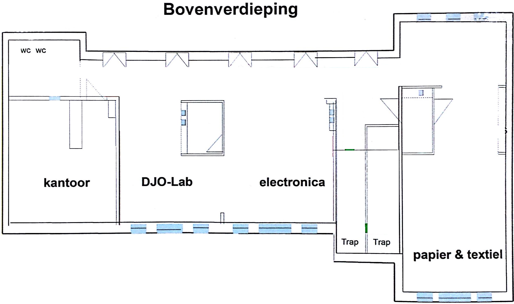

# Science en Hi-Tech dag 2018

 * Waar: De Jonge Onderzoekers Groningen, Dirk Huizingastraat 13, Groningen
 * Wanneer: zondag 10 juni 2018 12:00-16:00  :white_check_mark:
 * Entree: gratis

## Persbericht

Op zondag 10 juni organiseren we de Science & Hi-Techdag bij De Jonge Onderzoekers!

Er zijn genoeg makers die gave dingen maken. Op TV en YouTube zie je hun robots, 3D printers, games, machines, 3D modellen en proefjes. Zou jij dit ook willen? Zet dan je eerste stap op de Science en Hi-Tech dag! De Jonge (en ook volwassen) Onderzoekers leren je het allereerste begin. Alleen maar kijken is geen optie!

Verschillende afdelingen en cursussen presenteren zich op deze dag! Zo zullen er demonstraties zijn van Arduino, van het First Lego League team, van de Codestarter Codeclub, van de 3D club en de Natuur&Techniek Cursus. En nog veel meer. En het blijft niet bij presenteren. Je kunt bijna overal ook meedoen! 

De Science en Hi-Tech dag is op zondag 10 juni 2018 van 12:00-16:00 bij De Jonge Onderzoekers, Dirk Huizingastraat te Groningen. De entree is gratis.

Meer informatie over het programma volgt zsm via onze website www.djog.nl!

## Activiteiten

afdeling|activiteit
---|---
3D printers|?Print een raket
Arduino|Programmeer een machine
Dojo|Programmeer een game
Natuur & Techniek|?Meerdere experimenten
FLL|?Bouw een robot
FTC|?Bedien een robot
Drone|Demonstratie
Afstand meter|Afstand meten
Mensen van de universiteit|?Robot besturen

## Locaties

afdeling|locatie
---|---
3D printers|Houtlokaal
Arduino|Kantine
Dojo|Kantine
Natuur & Techniek|Lab
FLL|Papier en textiel
FTC|Electronica-afdeling
Drone|Plein
Afstand meten|?
Mensen van de universiteit|Fijnmetaal lokaal (ook wel 'Aquarium')

## PR

[Het is nog niet besproken wie de PR doet]

## Entree

Bij de entree komt een receptie, bemand door [iemand].

[Harry regelt de mensen voor de entree, zoals Eddy of Tonnie]

## Bar

Bar blijft onbemand.
Ranja staat klaar en is gratis.
Koffie en thee is 50 cent en kan met een pot betaald worden.

## Foto's

[iemand] maakt foto's

[Harry regelt een fotograaf, zoals Sam]

## Contactpersonen

afdeling|contactpersoon
---|---
3D printers|?Arlette, ?Erik, ?Jan de J., ?Martijn [RJCB, status: gemaild om interesse]
Arduino|?Anko, ?Anton, ?Martin [RJCB, status: gemaild om interesse]
Dojo|?Dagmar [RJCB, status: gemaild om interesse]
Natuur & Techniek|?Bas, ?Peter, ?Selinde  [RJCB, status: gemaild om interesse]
FLL|?Harry [Harry regelt dit]
FTC|?Harry [Harry regelt dit]
Drone|?Klaas [Harry regelt dit]
Afstand meten|?Geert-Jan [Harry regelt dit]
Mensen van universiteit|? [Harry regelt dit]

## Vorige jaar

 * [Science en Hi-Tech dag 2017](https://github.com/richelbilderbeek/science_en_hi-tech_dag_2017)

